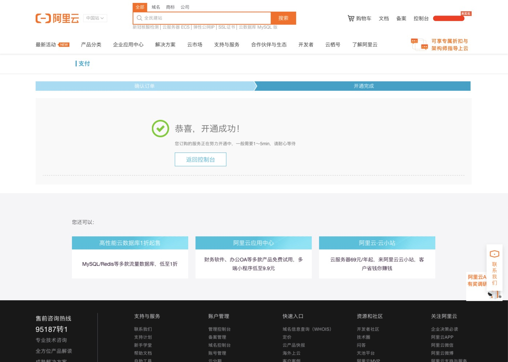

# Pepper Mask Detection

This is a simple example of a minimally DetectMask application integrated with the third-party SDK from the AliCloud Vision Intelligence Open Platform.

Pepper will:

 * Discontinuously take pictures with the top camera from Pepper's head, and display on the tablet.
 * Perform mask detection on the face with the largest area in the input picture.
 * Say a sentence based on  the detection results.	
		The detection results include:
		
		Result 	| Contents to Say 
		-----------------------------------------------------------
		0 		| Sorry, cannot recognize your face.
		1 		| Warning, you don't wear face mask.
		2 		| Warning, you should wear face mask with correctly.
		3 		| Well done, you wear the face mask correctly.
 	

The project contains:

 * One application in English, "Pepper Mask Detected" as project name.
 

## Project Structure

As shown in the  project structure above, the main package is introduced as follows:

1) Under the package "cn.softbankrobotics.detectmask", "MainActivity" is the main entry of this application.

2) The package "com.aliyun" and "sun.net.util" are to re-write the codes from  the AliCould library.（Because some Java features are incompatible with the current Android version of Pepper). 

## Usage

### 1. Clone or download this project.

### 2. Import this project in Android Studio.

### 3. Configuration 

In order to run this project on Pepper, first of all, you must require the credentail infomation from [AliCloud Vision Intelligence Open Platform](https://vision.aliyun.com), including AccessKey ID and AccessKey Secret.

#### Step 1: Login/Register on AliCloud

Login to AliCloud Platform (https://www.aliyun.com/) if you have account, or register one.

#### Step 2: Open Mask Detection Service

Open website for AliCloud Vision Intelligence Open Platform (https://vision.aliyun.com), and click on the red mark.

#### Step 3: Buy the service

As shown in the below picture, choose the region and buy it.

Please accept the protocol shown in the below picture and pay for it.

Open successfully.

#### Step 4: Open console

#### Step 5: Require AccessKey

In the console interface, click on AccessKey in the personal infomation, shown in the picture below

**Tips**:  Considering to the account security management, we strongly recommend apply RAM function. RAM (Resource Access Management) is a service provided by Alibaba Cloud that manages user identity and access to resources. With RAM, you can create, manage, and control the permissions of RAM users for resources, such as employees, systems,or applications. Here is the references below: 

	* [How to create a RAM user (https://www.alibabacloud.com/help/doc-detail/121941.htm?spm=a2c63.l28256.b99.14.644928fdCVy3VS)
	* Grant permissions to a RAM user (https://www.alibabacloud.com/help/doc-detail/121945.htm?spm=a2c63.p38356.b99.17.203e2fc4f7um7c)
	* Directly grant users the system authority policy AliyunVIAPIFullAccess (administrative authority of visual intelligence API)

#### Step 6: Create AccessKey ID and AccessKey Secret

Click on the red mark to create AccessKey ID and AccessKey Secret.

Create Successfully.

#### Step 7: Configuration in the project

Open "MainActivity" class under the package of "cn.softbankrobotics.detectmask", and find the "Config" class, replace the accessKeyId and accessKeySecret.

